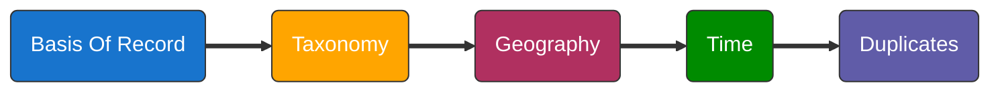

CRF ("Cleaning Records and Filter") app was created to facilitate the process of filtering, cleaning and validating occurrences species records from available repositories.
Here you will find a "step by step" workflow that goes over 5 different dimensions concerning to data records.
The main objective is to help the user assessing all the 5 aspects of data records considering their pros and cons.
Users will also find a series of suggestions to overcome each step with R functions, web services, fields to consider, bibliographic references of methods, etc. By selecting each of the scenarios the user will see how them affect to information certainty and data coverage.
Following the ideas of Meyer et al. 2016, some steps that reduce uncertainty imply decreases of data availability and viceversa. The user has to consider this trade off to choose the final filters

INSTRUCTIONS
1. Choose any dimension of the 5 available in the left panel (see flowchart below).
2. Select filters / steps in left-upper box (there are no previous selections marked).
3. Check "Pros / Cons" table that will display with each selection in the right-upper box (left panel).
4. Check "Methods" table that will display with each selection in the right-upper box (right panel).
5. Check how certainty/data coverage varies with each selection in the left-bottom panel for each dimension. Values goes from 0 (minimum certainty or data coverage available) to 1 (maximum certainty or data coverage available).
6. The users may download a "Final report" of the steps selected in each dimension providing the final guide to process their data and write their methods section.

