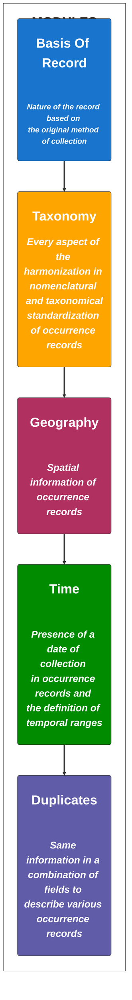

**[OCCUR](https://ecoinformatic.shinyapps.io/OCCUR/)** app is a "step by step" guide that goes over 5 different modules to curate biodiversity data records. It was created to facilitate the process of filtering,cleaning and validating occurrence species records from data repositories.This interactive workflow will help the user in the selection of data records between all possibilities depending on their study case, considering their pros and cons.Each module will also display how data certainty and data coverage change when selecting different scenarios of the application of filtering and cleaning rules.
https://ecoinformatic.shinyapps.io/OCCUR/

**INSTRUCTIONS**
1. Choose a module of the 5 available in the left panel.
2. Select between filters / steps in left-upper box (there are no previous selections marked).
3. Check the "Trade-off" table that will display with each selection in the right-upper box (left panel).
4. Check the "Methods" table that will display with each selection in the right-upper box (right panel).
5. See the bibliography associated in the "References" panel.
6. Check how certainty and data coverage varies with each selection in the left-bottom panel to make your final selection. Values goes from 0 (minimum certainty or data coverage available) to 1 (maximum certainty or data coverage available).
7. Download the final guide to process data and write the methods section based on the selected steps by module in the "Final report" tab.'

