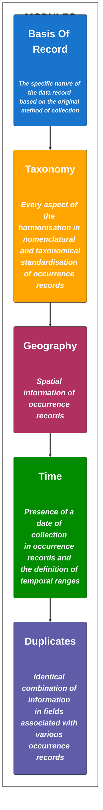

&nbsp;**[OCCUR](https://ecoinformatic.shinyapps.io/OCCUR/)** app is a step by step guide that was created to facilitate the process of filtering, cleaning and validating occurrence species records from data repositories. This interactive workflow will help the user in the selection of data records between all possibilities depending on their study case, considering their pros and cons. Each module will also display how data certainty and data coverage change when selecting different scenarios of the application of filtering and cleaning rules.
https://ecoinformatic.shinyapps.io/OCCUR/

OCCUR app goes over 5 different modules to curate biodiversity data records. 

**INSTRUCTIONS**
1. Choose a module of the 5 available in the left panel.

2. Select between filters / steps in left-upper box (there are no previous selections marked).

3. Check the "Trade-off" table that will display with each selection in the right-upper box (left panel).

4. Check the "Methods" table that will display with each selection in the right-upper box (middle panel).

5. See the bibliography associated in the "References" panel and click in 'See ref' to open the link in your web browser.

6. Check an example of the associated "R Code" in the table that will display with each selection in the right-upper box (right panel). Use the 'copy' button to add the lines into your R code.

7. Check how certainty and data coverage varies with each selection in the left-bottom panel to make your final selection. Values goes from minimum certainty or data coverage available to  maximum certainty or data coverage available.

8. Check the options marked in each module in the bottom-right box.

9. Click in the Download button in the "Final report" tab to obtain your final guide to process data and write the methods section based on the selected steps by module. 

